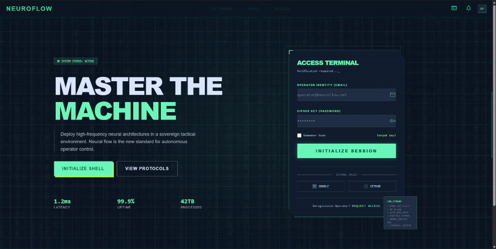
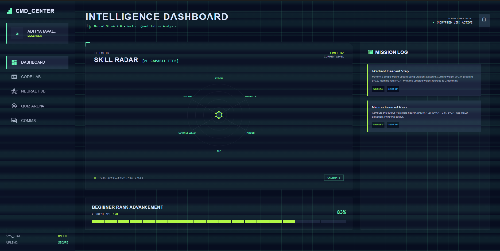
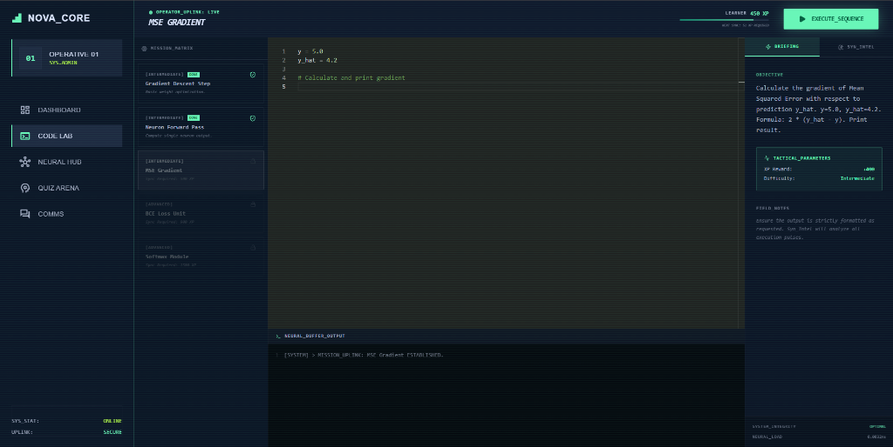
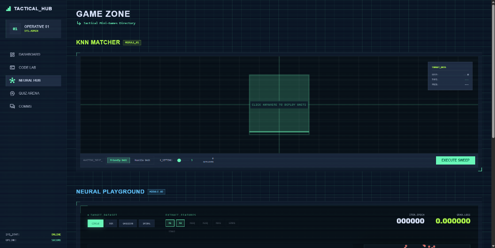
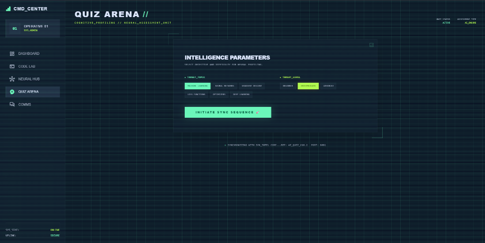

<div align="center">

```
███╗   ██╗███████╗██╗   ██╗██████╗  ██████╗ ███████╗██╗      ██████╗ ██╗    ██╗
████╗  ██║██╔════╝██║   ██║██╔══██╗██╔═══██╗██╔════╝██║     ██╔═══██╗██║    ██║
██╔██╗ ██║█████╗  ██║   ██║██████╔╝██║   ██║█████╗  ██║     ██║   ██║██║ █╗ ██║
██║╚██╗██║██╔══╝  ██║   ██║██╔══██╗██║   ██║██╔══╝  ██║     ██║   ██║██║███╗██║
██║ ╚████║███████╗╚██████╔╝██║  ██║╚██████╔╝██║     ███████╗╚██████╔╝╚███╔███╔╝
╚═╝  ╚═══╝╚══════╝ ╚═════╝ ╚═╝  ╚═╝ ╚═════╝ ╚═╝     ╚══════╝ ╚═════╝  ╚══╝╚══╝ 
```

### **The Open-Source AI/ML Learning OS**
*Learn. Build. Break. Master.*

---

[](https://vibethon-team-alpha-121.vercel.app/)
[](https://nextjs.org/)
[](https://www.typescriptlang.org/)
[](https://tailwindcss.com/)
[](https://supabase.com/)
[](https://deepmind.google/technologies/gemini/)
[](LICENSE)

<br/>

> **🏆 3rd Place — VIBETHON AI-Powered Coding Hackathon, DYPCET Kolhapur**  
> *Built in 4 hours. Now built for the world.*

<br/>

**[🌐 Live Demo](https://vibethon-team-alpha-121.vercel.app/) · [📖 Docs](#-strategic-overview) · [🐛 Report Bug](https://github.com/Aditya0292/Vibethon-TeamAlpha-121/issues) · [✨ Request Feature](https://github.com/Aditya0292/Vibethon-TeamAlpha-121/issues)**

</div>

---

## 🛰️ STRATEGIC OVERVIEW

Most people learn AI/ML by reading. **NeuroFlow makes you feel it.**

NeuroFlow is a fully interactive, AI-powered learning platform where you don't just consume content — you **run real Python code**, **play games that teach algorithms**, **break ML pipelines and fix them**, and get **instant AI feedback** on everything you do.

It's the platform we wished existed when we were learning ML. So we built it.

```
Traditional Learning          NeuroFlow
─────────────────────         ──────────────────────────────────
📄 Read about overfitting  →  🎮 Play "Fix The Model" — spot it live
📄 Watch gradient descent  →  🕹️ Drag a ball down a loss surface
📄 Copy code from tutorial →  💻 Write Python, get AI code review
📄 Take a static quiz      →  🤖 Gemini generates fresh questions
```

---

## ✨ OPERATIONAL FEATURES

### 🔐 Authentication & Onboarding
- Secure email/password registration via **Supabase Auth**
- Skill-level onboarding survey (Beginner → Advanced)
- Gemini generates a **personalized 4-week roadmap** based on your goals

### 📚 Structured Learning Modules
6 production-quality modules across 3 levels:
- **Beginner**: Linear Regression, Decision Trees
- **Intermediate**: Neural Networks, K-Means Clustering
- **Advanced**: Random Forest, SVM

### 💻 Code Lab — Real Python Execution
- Write Python directly in the browser
- Powered by **Piston API** — real sandboxed execution
- AI-driven code reviews and mission hints via SYN_INTEL

### 🕹️ Tactical Mini-Games

**1. KNN Matcher (Module_01)**
> **Technical Description**: Interactive K-Nearest Neighbors visualizer implementing real-time Euclidean distance calculations and majority voting logic on a 2D coordinate plane.
- **Why it's better**: Continuous feedback loop. Unlike static plots, operatives can deploy "Units" (data points) and immediately observe how decision boundaries and outlier influence shift. It turns abstract classification into spatial tactical logic.

**2. Neural Playboard (Module_02)**
> **Technical Description**: A real-time neural network architecture sandbox allowing direct manipulation of weights, biases, and activation functions via tactile hardware-style sliders.
- **Why it's better**: Demystifies the "black box." By manually adjusting weights and seeing the loss surface react instantly, operatives gain an intuitive understanding of backpropagation and optimization that traditional textbooks cannot convey.

### 📊 XP & Progression
- Tiered ranking from **Beginner** to **ML Expert**.
- Dynamic Skill Radar telemetry tracker.

---

## 📡 TERMINAL HIERARCHY

| Sector | Tactical Codename | Description | Visual Reference |
| :--- | :--- | :--- | :--- |
| **Home / Auth** | `ACCESS_TERMINAL` | Initial uplink with encrypted registration & session initialization. |  |
| **Dashboard** | `CMD_CENTER` | Real-time tactical telemetry and mission log synchronization. |  |
| **Code Lab** | `NOVA_CORE` | Integrated development environment for neural mission execution. |  |
| **Neural Hub** | `TACTICAL_HUB` | Interactive visualizers for algorithmic stress-testing and deployment. |  |
| **Quiz Arena** | `QUIZ_ARENA` | Cognitive profiling unit for mission-readiness assessments. |  |

---

## 💎 UI ARCHITECTURE

The platform achieves its **"Liquid Glass"** aesthetic through a multi-layered global CSS implementation.

#### Tactical Scanlines (Global Overlay)
```css
.scanlines {
  position: fixed;
  inset: 0;
  background: repeating-linear-gradient(
    to bottom,
    transparent,
    transparent 1px,
    rgba(105, 246, 184, 0.04) 1px,
    rgba(105, 246, 184, 0.04) 2px
  );
  pointer-events: none;
  z-index: 10000;
  animation: scanline_float 30s linear infinite;
}
```

---

## 🛠️ TECH STACK

| Layer | Technology | Specification |
|-------|-----------|-----|
| **Framework** | Next.js 14 | App Router, Server Components |
| **Styling** | Tailwind CSS | Institutional "Liquid Glass" Theme |
| **Auth & DB** | Supabase | PostgreSQL, Real-time persistence |
| **AI Engine** | Gemini 2.0 Flash | Multimodal inference engine |
| **Execution** | Piston API | Sandboxed Python 3.10 Runtime |

---

## 🚀 GETTING STARTED

1. **Install Dependencies**: `npm install`
2. **Configure Environment**: Create `.env.local` with Supabase and Gemini keys.
3. **Database Setup**: Run `./supabase/migrations/20240416_create_profiles.sql` in Supabase SQL editor.
4. **Deploy Uplink**: `npm run dev`

---

## 📜 MISSION LOGS (DEVELOPMENT PHASES)

#### 🟢 PHASE 1: INITIAL UPLINK
- Established "Liquid Glass" design system and strict TypeScript protocols.
- Secured the perimeter with Supabase Authentication.

#### 🟡 PHASE 2: COMMAND CENTER (DASHBOARD)
- Finalized unified sidebar navigation and SkillRadar data visualization.

#### 🔴 PHASE 3: ARMORY DEPLOYMENT (INTERACTIVE GAMES)
- Activated the KNN Visualizer and Neural Lite sandboxes.

#### 🌌 PHASE 4: LIVE PERSISTENCE & GLOBAL UPLINK
- Migrated to full Supabase persistence and Global Leaderboard.

---

## 👥 TEAM

| Role | Person |
|------|--------|
| 🧠 AI/Backend | [Aditya](https://github.com/Aditya0292) |
| 🎨 Frontend/UI | [Vedant](https://github.com/notvedantt) |

---

## 📄 LICENSE

Distributed under the MIT License. See [LICENSE](LICENSE) for more information.

---

<div align="center">

**Built with 🧠 at VIBETHON · Grown with ❤️ for the community**

*"Learn AI. Break AI. Become AI."*

</div>